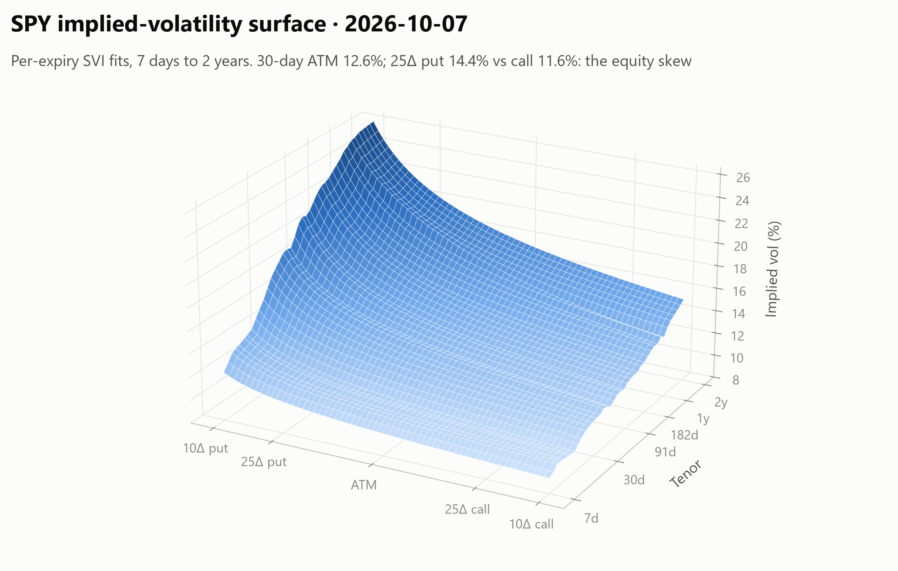
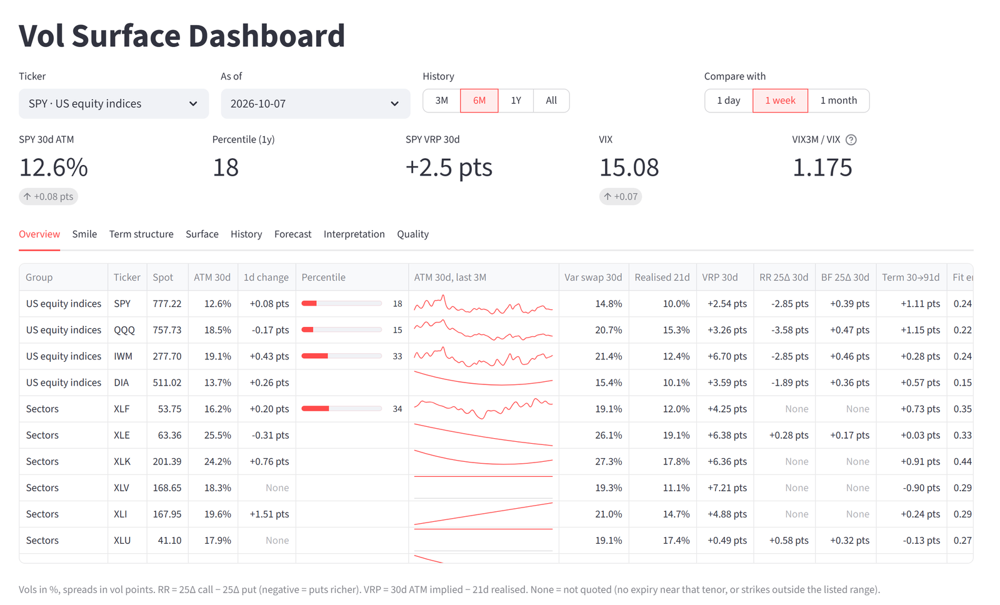
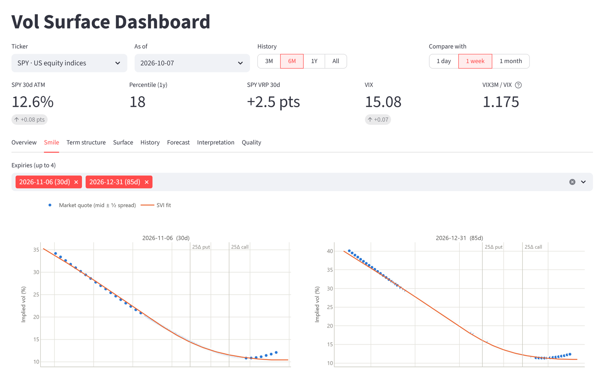
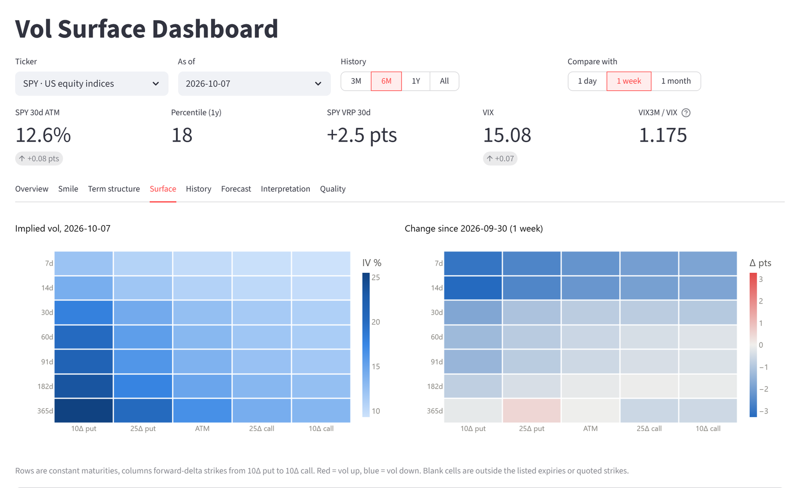
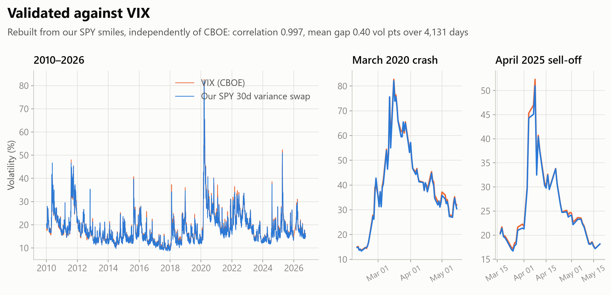
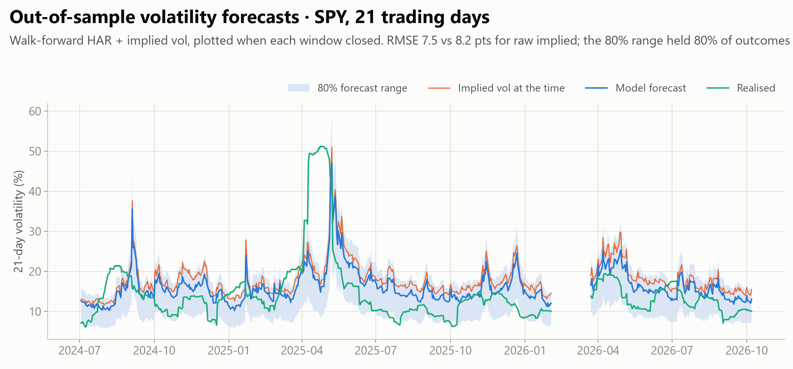
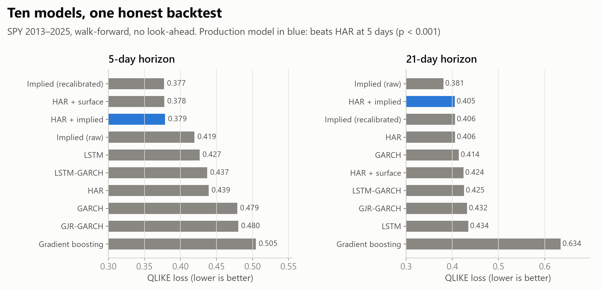
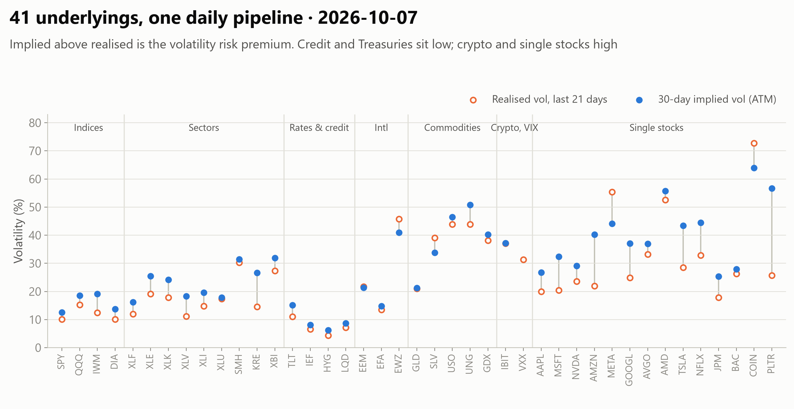

# Stochastic Vol Surface

[](https://github.com/AndrewFSee/stochastic-vol-surface/actions/workflows/tests.yml)


[](LICENSE)

**An end-to-end implied-volatility platform.** Every trading day it collects
option chains for 41 US equity and ETF underlyings, fits arbitrage-aware
volatility surfaces, and publishes a point-in-time feature table for
machine-learning models. It also produces backtested volatility forecasts
and serves everything in an interactive dashboard with written commentary
from Claude.

<picture>
  <source media="(prefers-color-scheme: dark)" srcset="docs/images/surface-dark.png">
  
</picture>

## Highlights

- **Surfaces that match the market's own benchmark.** Rebuilt independently
  from SPY option quotes, our 30-day variance swap tracks CBOE's VIX with
  **0.997** correlation over **4,131 days (2010–2026)**, including the March
  2020 crash and the April 2025 sell-off.
- **A production data pipeline, not a notebook.** Scheduled collection with
  a market-calendar timing guard, a pre-close snapshot for thin ETFs, a CBOE
  fallback when the primary source fails, daily backups, and health checks
  that raise desktop alerts.
- **ML-ready features with a data contract.** A 106-column point-in-time
  table covers surface shape, variance swaps, realised vol, CBOE vol indices,
  FRED macro and credit series, and earnings. Every column's unit and
  NaN rule is documented, and forward labels come aligned for training.
- **Forecasts chosen by an honest backtest.** Ten models, from GARCH to
  LSTM-GARCH hybrids, were walk-forward tested with no look-ahead. The
  winner, HAR + implied vol, is significantly better than HAR at 5 days.
  Modelling earnings explicitly cut single-stock forecast error (QLIKE) by
  25% at 5 days and 21% at 21 days across 14 stocks.
- **Engineered to last.** 300 offline tests in CI, a pinned dependency lock,
  re-executable notebooks documenting every result, and a dashboard that
  never extrapolates beyond quoted strikes.

## At a glance

<picture>
  <source media="(prefers-color-scheme: dark)" srcset="docs/images/dashboard_overview-dark.png">
  
</picture>

<table>
<tr>
<td width="50%">
<picture>
  <source media="(prefers-color-scheme: dark)" srcset="docs/images/dashboard_smile-dark.png">
  
</picture>
<p align="center"><sub>Fitted smiles over the market quotes they came from</sub></p>
</td>
<td width="50%">
<picture>
  <source media="(prefers-color-scheme: dark)" srcset="docs/images/dashboard_surface-dark.png">
  
</picture>
<p align="center"><sub>Tenor × delta surface and how it moved this week</sub></p>
</td>
</tr>
</table>

<picture>
  <source media="(prefers-color-scheme: dark)" srcset="docs/images/vix_validation-dark.png">
  
</picture>

<picture>
  <source media="(prefers-color-scheme: dark)" srcset="docs/images/forecast-dark.png">
  
</picture>

<picture>
  <source media="(prefers-color-scheme: dark)" srcset="docs/images/models-dark.png">
  
</picture>

<picture>
  <source media="(prefers-color-scheme: dark)" srcset="docs/images/cross_asset-dark.png">
  
</picture>

<sub>Figures are generated from the project's own data by
`python scripts/make_readme_figures.py`; screenshots are of the Streamlit
dashboard (`src/dashboard/app.py`).</sub>

## How it works

The pipeline scrapes option chains each day after the close and fits an SVI
smile per expiry on parity-implied forwards. It interpolates those to
constant maturities, derives level, skew, term-structure, variance-swap and
realised-vol features, and serves them in a Streamlit dashboard.
`scripts/validate_surfaces.py` re-checks the VIX benchmark.

Research code that is not validated against market data (parametric models,
a neural SDE, trading signals, a backtest engine, LLM agent stubs) lives in
[`experimental/`](experimental/README.md), outside the main package.

---

## Architecture

```
stochastic-vol-surface/
├── config/
│   ├── default.yaml         # Scraper tickers and settings
│   └── surface_grid.yaml    # Log-moneyness × tenor grid of the stored surfaces
├── src/
│   ├── data/                # Ingestion: options (yfinance), VIX, FRED rates, prices, Kaggle
│   ├── surface/             # IV inversion, per-expiry SVI, grid, validation
│   ├── features/            # Point-in-time feature table
│   ├── forecast/            # Volatility forecasts: dataset, models, walk-forward evaluation
│   ├── interpret/           # Claude interpretation of a ticker/date snapshot
│   └── dashboard/           # Streamlit app
├── scripts/                 # CLI entry points
├── tests/                   # Pytest suite (offline, synthetic data)
└── experimental/            # Parked research code; see experimental/README.md
```

---

## Quick Start

```bash
# 1. Install (exact versions from the lock file, or the latest compatible ones)
pip install -r requirements.lock && pip install -e . --no-deps
# pip install -e ".[dev]"

# 2. Configure secrets
cp .env.example .env
# edit .env with your FRED_API_KEY (and Kaggle credentials for the historical backfill)

# 3. Collect today's data (options + VIX + rates + prices + surfaces + features)
python scripts/schedule_scraper.py --once

# 4. Backfill rates, underlying prices and VIX history (all serve full history)
python scripts/backfill_rates.py --start 2026-01-01
python scripts/backfill_underlying.py --start 2024-01-01
python scripts/backfill_vix.py --start 2024-01-01
python scripts/backfill_macro.py --start 2009-01-01
python scripts/fetch_earnings.py

# 5. Build the surface corpus from every stored chain
python scripts/build_surfaces.py --report data/logs/surface_build.csv

# 6. Build the feature table (the main output) and the vol forecasts
python scripts/build_features.py
python scripts/build_forecasts.py

# 7. Check corpus health and surface accuracy at any time
python scripts/data_health.py
python scripts/validate_surfaces.py --strict

# 8. Launch the dashboard
python -m streamlit run src/dashboard/app.py
```

On Windows without an activated virtual environment, call its interpreter
directly: `.\.venv\Scripts\python.exe -m streamlit run src\dashboard\app.py`.

---

## Data Pipeline

| Source | Module | Description |
|---|---|---|
| yfinance | `src/data/scraper.py` | Daily options chains (41 tickers, below) |
| CBOE | `src/data/cboe.py` | Fallback chains (free delayed quotes) when a yfinance chain fails or is thin |
| yfinance | `src/data/vix_family.py` | VIX, VIX3M, VIX9D, VIX1D, SKEW, VVIX; VXN, VXD, OVX, GVZ, MOVE |
| FRED API | `src/data/rates.py` | Risk-free curve (DGS1MO…DGS10) |
| FRED API | `src/data/macro.py` | Credit spreads, dollar, breakevens, real yields, financial-stress indices |
| yfinance | `src/data/underlying.py` | Daily OHLC for the tickers (realised vol) |
| yfinance | `src/data/events.py` | Earnings dates (past and scheduled) for the single stocks |
| Kaggle | `src/data/kaggle_loader.py` | Historical SPY chains: 2010–2023 (CSV) and 2024–2025 (JSON) |
| Parquet | `src/data/storage.py` | Partitioned storage with dedup |
| — | `src/data/health.py` | Coverage / freshness / quality reporting |

**Tickers** (`config/default.yaml`), chosen for liquid listed options on yfinance:

| Group | Tickers |
|---|---|
| US equity indices | SPY, QQQ, IWM, DIA |
| Sectors | XLF, XLE, XLK, XLV, XLI, XLU, SMH, KRE, XBI |
| Rates and credit | TLT, IEF, HYG, LQD |
| International | EEM, EFA, EWZ |
| Commodities | GLD, SLV, USO, UNG, GDX |
| Crypto, VIX futures | IBIT, VXX |
| Single stocks | AAPL, MSFT, NVDA, AMZN, META, GOOGL, AVGO, AMD, TSLA, NFLX, JPM, BAC, COIN, PLTR |

The first 8 (SPY, QQQ, IWM, GLD, AAPL, MSFT, TSLA, XLF) have been collected
since Feb 2026; the rest since Oct 2026. XLY, XLP, FXI and EWJ were left out:
their chains are too thin for a stable surface. The thinner ETFs (UNG, HYG,
LQD, XLU, KRE) list few short-dated strikes, so their short-tenor features are
often NaN.

### Storage layout

```
data/
├── options/ticker={T}/date={D}/chain.parquet    # raw chains
├── surfaces/ticker={T}/date={D}/surface.parquet # 25 × 8 IV grids
├── vix/vix_{D}.parquet                          # rolling 5-day snapshots
│   └── vix_history.parquet                      # consolidated series
├── rates/rates_history.parquet                  # merged FRED curve
├── macro/macro_history.parquet                  # FRED credit/macro series
├── events/earnings.parquet                      # earnings dates per stock
├── underlying/prices.parquet                    # daily OHLC, (date, ticker)
├── features/surface_features.parquet            # one row per (ticker, date)
├── forecasts/vol_forecasts.parquet              # one row per (ticker, date, horizon)
├── interpretations/ticker={T}/{D}.json          # cached Claude interpretations
└── logs/scrape_runs.jsonl                       # one line per collection run
```

Each daily VIX snapshot stores a rolling 5-day window, so consecutive files
overlap. `load_vix_history()` merges them, which recovers values that had not
settled when first collected (notably `SKEW`). Always read VIX through that
function rather than a single snapshot file.

### Daily automation

`scripts/schedule_scraper.py --once` runs one full cycle — chains, VIX, rates,
underlying prices, surfaces, the feature table, then the vol forecasts —
skipping non-trading days via the NYSE calendar. On Windows it
is driven by a Task Scheduler entry (`\StochasticVolSurface\DailyScraper`) at
16:30 ET, Mon–Fri. Each run appends to `data/logs/scrape_runs.jsonl`.

**Pre-close snapshot for thin ETFs.** Market makers pull their quotes on thin
ETF options at the 16:00 close. At 16:30 most out-of-the-money XLV options
show a zero bid against a $0.50–$2 ask, and four tickers (XLV, HYG, LQD, EFA)
got no surface at all on the first full run. So the tickers in
`scraper.preclose_tickers` (`config/default.yaml`) are collected by a second
task, `\StochasticVolSurface\PrecloseScraper`, at 15:45 ET
(`schedule_scraper.py --preclose`, allowed only in the last half hour before
the close). Their rows carry `snapshot = "preclose"`, and the 16:30 run keeps
those chains instead of re-scraping, then builds their surfaces and features
with everyone else's. If the pre-close run did not happen, the 16:30 run
collects them as before. Their spot is about 15 minutes before the close,
and the stored close is corrected by the next day's price refresh.
Pre-close runs append to `data/logs/preclose_runs.jsonl`.

### Backup and alerts

The last two steps of every daily run protect the data and check it:

- **Backup.** `data/` is copied incrementally to the drive set in
  `config/default.yaml` (`backup.dir`, currently
  `D:/stochastic-vol-surface-backup`). Only new or changed files are copied,
  and nothing is ever deleted from the backup. Afterwards the option chains,
  which cannot be re-downloaded, are verified file for file. To restore, copy
  `<backup>/data` back over `data/`. Run it by hand with
  `python scripts/backup_data.py`.
- **Health checks.** `src/data/monitor.py` verifies that the run had no
  errors, every ticker got the latest session's chain and surface, the
  features and forecasts are current, SPY's 30d variance swap still tracks VIX
  (63-day daily-change correlation ≥ 0.8, mean gap ≤ 1.5 pts, latest gap
  ≤ 3 pts), the backup is under two days old, and the data and backup drives
  each have at least 5 GB free (the store grows ~4–5 GB a year with 41
  tickers). Results are appended to
  `data/logs/health_checks.jsonl`. Any failure raises a Windows desktop
  notification and a banner at the top of the dashboard, and the Quality tab
  lists the latest results. Run the checks by hand with
  `python scripts/check_health.py` (add `--test-notification` to test the
  alert).

---

## Surface Corpus

`src/surface/batch.py` turns the raw chain store into the standardised surface
store that the feature table and dashboard read (and the experimental models).

* **Resumable** — existing surfaces are skipped unless `--overwrite`, so the
  daily incremental run costs one build per ticker.
* **Real rates** — the discount rate is the FRED curve interpolated to each
  snapshot's tenor, not a hard-coded constant.
* **Quality-gated** — every grid is scored before it is written; non-finite or
  implausible grids are rejected rather than poisoning training data.

```python
from src.surface.batch import load_surface_history

dates, k_grid, t_grid, grids = load_surface_history("SPY")
# grids.shape == (n_dates, 25, 8)
```

---

## Surface Construction

Surfaces are built **one expiry at a time** (`src/surface/slices.py`, builder
`expiry-svi/1`):

1. **Clean quotes** – two-sided markets only, bounded relative spread.
2. **Implied forward** – from put-call parity near the money, per expiry.
   This carries dividends and borrow; `S·e^{rT}` is ~0.9% too high for SPY at
   two years and ~2% for XLF.
3. **OTM Black-76 IVs** – inverted from bid/ask mids (vectorised solver in
   `src/surface/implied_vol.py`); puts below the forward, calls above. Yahoo's
   own `impliedVolatility` is not used when prices are available.
4. **SVI per expiry** – quasi-explicit fit, weighted by bid-ask spread in vol
   terms, constrained to positive variance and Lee's wing bound, with one
   round of outlier rejection.
5. **Across tenors** – total variance linear in T between the two bracketing
   expiries (VIX's constant-maturity construction), then a calendar
   monotonicity clean-up (`src/surface/filters.py`).
6. **VolSurface** (`src/surface/surface.py`) – grid plus an `observed` mask
   (False where a cell is extrapolated beyond quoted strikes or expiries) and
   the per-expiry fits (forward, SVI params, fit RMSE) in the file metadata.

Each saved surface records its builder. `build_surfaces.py` rebuilds
surfaces from an older builder instead of skipping them, and
`load_surface_history` loads only the current builder by default, so a
history never silently mixes methods. The old pooled-bin pipeline
(`grid_builder.build_surface_grid` / `interpolate_to_grid`) is still
reachable with `method="rbf"` but should not feed features or models.

### Design note: why not a joint SSVI fit

A joint eSSVI fit (Gatheral–Jacquier SSVI with per-expiry ρ; θ and ρ per
expiry plus two shared parameters) was evaluated in October 2026 as a way to
steady thin chains. On SPY its fit error was 3–4× the per-expiry SVI's at
every expiry (0.9 vs 0.3 vol pts), and its constrained smile shape moved the
30d 25Δ risk reversal by about 2 vol points. It traded noise for bias, so it
was not adopted. The remaining noise (see the feature table's noise floors)
is quote-level, not model-level.

### Checking accuracy

```bash
python scripts/validate_surfaces.py --strict
```

Rebuilds SPY's 30-day variance-swap vol from the fitted smiles and compares
it with VIX (same definition, computed by CBOE from SPX). It also reports
daily-change noise for every ticker. A strongly negative lag-1
autocorrelation of daily changes means jumps that revert the next day, which
is measurement noise.

---

## Feature Table

`data/features/surface_features.parquet` is the project's main output: one
point-in-time row per (ticker, trading date), for the dashboard and for
downstream models. `scripts/build_features.py` rebuilds it in full from the
surface, price, VIX and macro stores, and the daily run does the same. The
per-surface features are cached in `data/features/_surface_rows_cache.parquet`
keyed by each surface file's modification time, so a daily rebuild only reads
new or rebuilt surfaces (about 20 s instead of 3 min); `--no-cache` recomputes
everything. The cache is discarded when `FEATURE_VERSION` changes.

```python
from src.features import load_feature_table, training_frame, describe

df = load_feature_table(tickers=["SPY", "QQQ"], start="2026-06-01")

# Historical + live rows with forward labels over (t, t+h] sessions:
# label_rv_<h> (realised vol), label_ret_<h> (log return),
# label_atm30_chg_<h> (change in 30d ATM vol).
train = training_frame(horizons=(5, 21))
describe("rr25_30d")    # unit, meaning and when the column is NaN
```

**Data contract.** `src/features/catalog.py` documents every column (group,
unit, meaning, when NaN); `python scripts/feature_catalog.py` writes
[docs/feature_catalog.md](docs/feature_catalog.md) and a machine-readable
`docs/feature_catalog.json`. A test fails if the builder adds a column the
catalog does not cover. Labels look into the future: never use them as
features, and split train/test by date with a gap of at least *h* sessions.

**Timing.** Row *t* uses only what was known at about 16:30 ET on *t*: that
day's option snapshot, the underlying's close and the VIX closes. To predict
anything over `(t, t+h]`, use row *t*. Rolling statistics are trailing and
include *t*. A test checks that appending later rows never changes earlier
ones.

| Group | Columns | Notes |
|---|---|---|
| ATM term structure | `atm_{7,14,30,60,91,182,365}d` | Forward-ATM implied vol at constant maturity |
| Smile (30d, 91d) | `iv_{p10,p25,c25,c10}_*`, `rr25_*`, `bf25_*`, `rr10_*`, `bf10_*`, `atm_skew_*`, `atm_curv_*` | Exact forward-delta strikes; `rr` = call − put |
| Variance swap | `vs_30d`, `vs_91d` | Model-free, VIX's definition |
| Term spreads | `ts_7_30`, `ts_30_91`, `ts_30_365` | Longer minus shorter ATM vol |
| Carry | `fwd_carry_1y` | ln(F/S)/T: rate − dividend − borrow. Level only; daily changes are mostly noise |
| Realised | `ret_{1,5,21}d`, `rv_cc_{10,21,63}d`, `rv_yz_21d` | Zero-mean close-to-close and Yang-Zhang |
| Premia | `vrp_30d`, `vrp_var_30d` | ATM − RV in vol; VS² − RV² in variance |
| Market | `mkt_vix`, `mkt_vix3m`, `mkt_vix9d`, `mkt_vix1d`, `mkt_vvix`, `mkt_skew`, `mkt_vxn`, `mkt_vxd`, `mkt_ovx`, `mkt_gvz`, `mkt_move` | Index closes, same for every ticker. VIX1D starts in 2023 |
| Macro | `macro_hy_oas`, `macro_ig_oas`, `macro_usd_broad`, `macro_breakeven_10y`, `macro_real_yield_10y`, `macro_stlfsi`, `macro_nfci` | FRED, joined by **publication** date (below) |
| Earnings | `earn_next_date`, `earn_days_to`, `earn_days_since`, `earn_implied_move`, `earn_hist_move` | Single stocks only (NaN for funds); see Earnings below |
| Dynamics | `<col>_d1`, `_d5`, `_z63`, `_pct252` | For the key columns; laid on the NYSE calendar, so a missing day is a gap, not a 2-day change |
| Quality | `n_expiries`, `nearest_expiry_days`, `fit_rmse`, `parity_fraction` | Use to down-weight weak days |

**Macro timing.** FRED dates a value by the period it describes, not the day
it was published: the weekly NFCI for the week ending Friday appears the
following Wednesday. `src/data/macro.py` shifts each series by its publication
lag (1 day for the daily series, 5 for NFCI, 6 for STLFSI) before an as-of
join, so row *t* only sees values that were public on *t*. The credit-spread
series (HY/IG OAS) are only licensed to FRED for the last 3 years, so they are
NaN on older historical rows.

Vols are decimals (0.15 = 15%). **Nothing is extrapolated.** A feature whose
tenor falls outside the listed expiries, or whose strike falls outside the
quotes of the bracketing expiries, is NaN. For example, XLF often lists no
expiry near 7 days.

**Noise floors.** Each feature's daily change mixes real moves with
measurement noise. Treating the series as a random walk plus independent
noise, the noise standard deviation is √(−ρ₁·Var(Δ)), where ρ₁ is the lag-1
autocorrelation of daily changes. Estimated on the live corpus (Feb–Oct 2026),
in vol points:

| Feature | SPY, QQQ, IWM | AAPL, MSFT, TSLA, GLD | XLF |
|---|---|---|---|
| `atm_30d`, `vs_30d` | ~0.5 (2–3% of level) | 0–0.6 | 0.5–1.0 |
| `rr25_30d` | ~0.3 (5–8% of level) | ~0.3 (15–22% of level) | ~0.4 |
| `bf25_30d`, `bf25_91d` | 0.02–0.05 | 0.03–0.09 | ~0.15 |

The 30d risk reversal on single names is the one feature where noise is a
large share of the level. It is quote-level noise at the 25-delta strikes; it
does not come from the 30-day interpolation (days when the bracketing
expiries roll are no noisier). Prefer `_d5` changes or smoothing for it.

---

## Historical backfill

The live corpus starts in Feb 2026 and contains no crisis regime. Historical
SPY chains fill that gap without waiting:

```bash
python scripts/backfill_kaggle.py --list          # inspect the dataset
python scripts/backfill_kaggle.py --download      # all years
python scripts/backfill_kaggle.py --download --years 2018 2020 2022

# Inputs of the same era: rates (for forwards), prices (realised vol), VIX
python scripts/backfill_rates.py --start 2009-01-01
python scripts/backfill_underlying.py -t SPY --start 2009-01-01
python scripts/backfill_vix.py --start 2009-06-01
python scripts/backfill_macro.py --start 2009-01-01

# Surfaces (parallel; 2010–2023 takes about 45 minutes on 7 workers), then features
python scripts/build_surfaces.py --options-dir data/historical/options \
    --surfaces-dir data/historical/surfaces --report data/logs/surface_build_historical.csv
python scripts/build_features.py --surfaces-dir data/historical/surfaces \
    --out data/historical/features/surface_features.parquet
python scripts/validate_surfaces.py --surfaces-dir data/historical/surfaces -t SPY
```

Historical data lands in **`data/historical/`**, deliberately separate from the
live yfinance corpus. The two differ in source, quote timing, and IV
convention, so keeping them apart preserves provenance — and stops a
2010-dated partition from breaking the daily freshness check. Pool them only
deliberately.

The VIX backfill is written to `data/vix/vix_0000_backfill.parquet`. Daily
snapshots take precedence over it wherever the two overlap.

Rebuilt in October 2026 with the per-expiry builder, the 2010–2023 corpus
(3,508 days) checks out against VIX about as well as the live one: SPY's 30d
variance swap has 0.969 daily-change correlation with VIX and a 0.42-pt mean
absolute difference. On 2020-03-16 it read 82.1 against VIX's 82.7. Median fit
error is 0.19 vol pts.

### 2024–2025: full chains from a second Kaggle dataset

The 2010–2023 CSV dataset stops at the end of 2023. A second free dataset,
[S&P500 Options (SPY) Implied Volatility (2014-25)](https://www.kaggle.com/datasets/shankerabhigyan/s-and-p500-options-spy-implied-volatility-2019-24),
has every listed SPY contract's end-of-day bid, ask, volume, open interest
and IV, one ~1 GB JSON file per year. `scripts/backfill_kaggle_json.py`
streams the files one trading day at a time (memory stays small) and takes
the underlying price from the SPY close in the price store:

```bash
python scripts/backfill_kaggle_json.py --download --years 24 25   # ~5 min after download
python scripts/build_surfaces.py -t SPY --options-dir data/historical/options \
    --surfaces-dir data/historical/surfaces
python scripts/build_features.py --surfaces-dir data/historical/surfaces \
    --out data/historical/features/surface_features.parquet
```

Built with the same per-expiry builder, the 486 days (2024: 252; 2025: 234,
the dataset skips 16 days) check out against VIX as well as the live data:
30d variance swap vs VIX level correlation 0.999, daily-change correlation
0.998, mean absolute difference 0.28 pts. They include the April 2025 sell-off.
The chains take ~105 MB and the surfaces ~18 MB.

With them, the historical store covers 2010–2025 (3,994 SPY days), and the
forecaster's walk-forward track record runs through 2024–2025 out of sample.
Over those two years it beat raw implied vol at 21 days (QLIKE 0.355 vs
0.367; RMSE 7.5 vs 8.0 vol pts), was slightly behind at 5 days (0.332 vs
0.322), and its 80% ranges held 80–81% of outcomes. Only 1 Jan – 18 Feb 2026 is
still missing; none of the free sources found covers it. Paid sources with
complete history: ORATS, ThetaData, CBOE DataShop, Polygon/Massive options.

To browse the history in the dashboard, point it at the historical store:

```bash
VSS_DATA_DIR=data/historical python -m streamlit run src/dashboard/app.py
# PowerShell: $env:VSS_DATA_DIR="data/historical"; python -m streamlit run src/dashboard/app.py
```

---

## Dashboard

```bash
python -m streamlit run src/dashboard/app.py
```

The dashboard reads the feature table and the per-expiry fits stored with
each surface. It computes nothing from live market data. Tickers are ordered
and labelled by asset class (`src/data/universe.py`), in the picker and in
the overview table. One filter row
(ticker, as-of date, history window, comparison period) scopes every view:

| Tab | Shows |
|---|---|
| Overview | Every ticker on one row: 30d ATM level, 1-day change, 1-year percentile, 3-month sparkline, variance swap, realised vol, VRP, risk reversal, butterfly, term spread, fit error |
| Smile | Fitted SVI smiles drawn over the market quotes they came from (mid ± half spread), with the 25Δ strikes marked |
| Term structure | ATM vol by days to expiry: as-of date vs 1 week and 1 month earlier, with the listed expiries |
| Surface | Implied vol on a tenor × delta grid, its change over the comparison period, and an optional 3D view |
| History | Implied vs realised vol, VRP, 25Δ risk reversal and term spread over time |
| Forecast | 5- and 21-day vol forecasts with 80% ranges beside implied vol; forecast vs implied vs realised history; the forecast's track record |
| Interpretation | A short written read of the ticker and date by Claude, generated on demand from the snapshot shown under "Inputs sent to Claude" |
| Quality | SPY's 30d variance swap vs VIX (the accuracy check), plus fit error and expiry count per ticker |

Every chart has a "Show data" table. Light and dark mode use separately
validated palette steps. Cells outside the quoted region are blank, never
extrapolated. Set `VSS_DATA_DIR` to point the app at another store; it
defaults to the project's `data` folder.

---

## Volatility Forecasts

`scripts/build_forecasts.py` (and the daily job) writes
`data/forecasts/vol_forecasts.parquet`: for every ticker and date, forecasts
of realised vol over the next 5 and 21 trading days, with an 80% range and
the implied vol used. Every row is out-of-sample. The model is refitted
monthly on targets already observed, so the stored history is also the
forecast's track record and can be used as a point-in-time ML feature.

**Model: HAR + implied vol, pooled across tickers.** It was chosen by
walk-forward evaluation on SPY 2013–2025; `python scripts/evaluate_forecasts.py
--lstm` reproduces the evaluation and writes `docs/forecast_evaluation.md`.

| Model (QLIKE, lower is better; 2,683 common days) | 5-day | 21-day |
|---|---|---|
| HAR + implied | **0.379** | 0.405 |
| HAR + implied + surface features | 0.378 | 0.424 |
| Implied vol, recalibrated | 0.377 | 0.406 |
| HAR | 0.439 | 0.406 |
| Implied vol alone (raw) | 0.420 | **0.381** |
| LSTM / LSTM-GARCH | 0.427 / 0.437 | 0.435 / 0.425 |
| GARCH / GJR-GARCH | 0.479 / 0.480 | 0.414 / 0.432 |
| Gradient boosting | 0.505 | 0.635 |

- At 5 days, HAR + implied beats HAR decisively (Diebold-Mariano
  p < 0.001); raw implied vol does not, because its upward bias (the risk
  premium) offsets its information. At 21 days nothing beats HAR
  significantly on QLIKE, but HAR + implied has the best RMSE and
  log-variance R².
- GARCH (returns only), gradient boosting and both LSTMs do worse. The
  LSTMs are no better than plain HAR (p ≥ 0.37) and significantly worse than
  HAR + implied at 5 days (p ≤ 0.02 in a direct test). With about 2,700
  overlapping daily targets, the flexible models overfit.
- Adding the 2024–2025 data (including the April 2025 sell-off) left every
  conclusion of the earlier 2013–2023 evaluation unchanged.
- Inputs are each ticker's own surface: 7-day ATM vol for 5 days (14-day
  where no 7-day expiry is listed, flagged), the 30-day variance swap for 21
  days. Coefficients are pooled, because the seven tickers with only seven
  months of history forecast much worse on their own.
- Out-of-sample 80% ranges hold 78–80% of outcomes.
- In the live 2026 sample, the model beats raw implied vol on index ETFs at
  21 days, whose implied vol carries a large risk premium. On single stocks
  and GLD, raw implied vol has been as good or better, probably because it
  prices known events such as earnings. Earnings are now modelled explicitly
  (below), which narrows but does not close that gap. The Forecast tab shows
  both track records side by side.

### Earnings

Single stocks jump on earnings, and option prices carry that jump. The
forecaster handles it explicitly (`src/forecast/forecaster.py`,
`src/features/earnings.py`):

- **Dates** come from yfinance (`scripts/fetch_earnings.py`, refreshed by the
  daily job). A release before the open moves that day's session; one after
  the close moves the next. On 875 past releases the mapped session's median
  absolute return is 4.6%, against about 1.4% on the days either side.
- **Implied earnings move.** For an expiry after the release, ATM total
  variance is `σ²·n + e²`: diffusion over *n* sessions plus the jump. Two
  expiries (one before and one after the release, or the first two after it)
  solve for `e`, with time counted in trading sessions so a weekend between
  weekly expiries does not distort it.
- **Forecast.** The HAR + implied model runs on ex-earnings inputs (past
  release days dropped from realised vol, the jump stripped from implied vol)
  and is fitted to ex-earnings variance. When a release falls in the window,
  `252/h · e²` is added back, using the implied move where the surface gives
  one and the stock's historical average move otherwise.

`scripts/evaluate_earnings.py` writes `docs/earnings_evaluation.md`:

| QLIKE (lower is better) | 5-day | 21-day |
|---|---|---|
| **14 stocks, 2013–2026, no options data** (~44,000 forecasts) | | |
| HAR | 0.538 | 0.312 |
| HAR, earnings-adjusted (historical move) | **0.406** | **0.247** |
| … windows containing a release: HAR → adjusted | 1.771 → 0.567 | 0.385 → 0.275 |
| **AAPL, MSFT, TSLA, Feb–Oct 2026, with options** (~6 releases) | | |
| HAR + implied (previous production model) | 0.338 | 0.145 |
| HAR + implied, earnings-adjusted (implied move) | **0.331** | 0.133 |
| Implied vol alone (raw) | 0.332 | **0.114** |

The long-sample gain is large and significant at both horizons
(Diebold-Mariano p < 0.001), including windows *without* a release, because
a past release no longer inflates the trailing realised vol. On the short
live sample the adjusted model beats the previous one everywhere, but not
significantly, and raw implied vol is still best at 21 days for single
stocks. Production uses the earnings-adjusted model (`forecast/2`).

The feature table carries the inputs for other models: `earn_next_date`,
`earn_days_to`, `earn_days_since`, `earn_implied_move`, `earn_hist_move`.
**Point-in-time dates.** Yahoo's history records each release's *actual*
date, which can differ from what was scheduled weeks earlier. Every refresh
therefore also saves the upcoming schedule to
`data/events/snapshots/earnings_<date>.parquet`, and feature rows covered by a
snapshot (from 6 Oct 2026) use the date scheduled at the time. Older rows use
the actual dates; within a few weeks of a release those were almost always
already public.

### Are the features useful?

On SPY 2010–2025, beyond the implied-vol level, no surface feature adds
significant predictive power:

- **Realised vol:** skew, butterfly, term structure and VVIX/SKEW, added to
  HAR + implied one group at a time, were insignificant at both horizons
  (p > 0.11). The variance risk premium makes 21-day forecasts significantly
  worse (p = 0.02).
- **Forward 21-day returns:** only implied vol survives a Bonferroni
  correction (t = 3.9, R² 4%). The 25Δ risk reversal is nominally significant
  (p = 0.006) but not after correction.
- **Forward variance-swap P&L:** nothing predicts it.

These are linear, one-index results. `scripts/feature_study.py` repeats the
question for every ticker with enough history and summarises it by asset
class ([docs/feature_study.md](docs/feature_study.md)): 17 surface, market,
macro and earnings features against excess variance (realised over implied),
forward return and the change in implied vol. A first run (Oct 2026, about
130 live days for the seven non-SPY tickers) hints that on single stocks the
30d risk reversal and ATM skew predict realised vol beyond implied (|t| > 2
in all three stocks, R² ≈ 0.2). That is about six independent windows per
stock, so it is a lead to re-test, not a result. Re-run the study in early
2027.

---

## Notebooks

Executed notebooks that document how the models were built and tested:

| Notebook | Covers |
|---|---|
| `notebooks/02_surface_construction.ipynb` | One day's chain to a surface: parity forwards, OTM IVs (and why not Yahoo's), per-expiry SVI, interpolation and masking. Then the surface backtest against VIX (2010–2025 and 2026), the old pipeline vs the new one, noise floors, and the rejected eSSVI fit |
| `notebooks/03_volatility_forecasting.ipynb` | The target, the no-look-ahead walk-forward method, every model, the backtests at 5 and 21 days with significance tests and regime breakdowns, LSTM and LSTM-GARCH, the feature-usefulness tests, pooling, interval calibration, the live 2026 track record, and the earnings model (timing, implied moves, the 14-stock backtest) |

They read from the local data stores. Rebuild and re-execute them with
`python notebooks/_build/build.py` (15–35 minutes depending on load, mostly the LSTMs; needs
`pip install -e ".[notebooks,experimental]"`). Cells live in
`notebooks/_build/nb_*.py`, so changes stay readable in diffs.

---

## Interpretation (Claude)

The Interpretation tab sends a structured snapshot of the selected ticker
and date to Claude (`claude-opus-5-5`) and shows a short written read. The
snapshot holds levels, changes, percentiles labelled with the history behind
them, the smile, term structure, realised vol, the forecast with its track
record, earnings (single stocks), market and credit context, data quality,
and peers: the same asset class plus SPY.

- **On demand and cached.** Nothing is sent until you press the button. Each
  result is stored in `data/interpretations/` per ticker and date, keyed by a
  hash of the snapshot, prompt version and model. Reopening is free, and a
  rebuilt snapshot marks the old text as stale.
- **Grounded.** The model is instructed to use only numbers in the snapshot,
  separate observation from interpretation, respect the measured noise
  floors, and not recommend trades. The exact inputs are shown under the
  text.
- **Setup:** add `ANTHROPIC_API_KEY=...` to `.env`. Requests opt into
  Anthropic's server-side refusal fallback (`fallbacks: "default"`), so a
  safety-classifier decline is retried on Anthropic's recommended model
  rather than failing.

---

## Configuration

Edit `config/default.yaml` to change the tickers and scraper settings.
Parameters for the parked research code are in `experimental/config.yaml`.

`config/surface_grid.yaml` (25 log-moneyness knots × 8 tenors) defines the
grid stored with each surface. Changing it invalidates every surface already
built, so re-run `scripts/build_surfaces.py --overwrite` afterwards. The
feature table does not depend on it: features are read from the per-expiry
fits at exact tenors and deltas.

---

## Environment Variables

| Variable | Description |
|---|---|
| `FRED_API_KEY` | FRED API key (free registration) |
| `ANTHROPIC_API_KEY` | Claude API key for the dashboard's Interpretation tab |
| `ANTHROPIC_WORKSPACE_ID` | Only if the key isn't scoped to a workspace: the workspace ID (`wrkspc_...`) to send |
| `OPENAI_API_KEY` | Optional; only the experimental agent stubs use it |
| `KAGGLE_USERNAME` | Kaggle username for backfill loader |
| `KAGGLE_KEY` | Kaggle API key |

---

## Running Tests

```bash
pytest tests/ -v
```

The suite is offline — every test builds its own synthetic chains in a
temporary store, so no network access or collected data is required.

**CI.** `.github/workflows/tests.yml` runs the suite on every push to `main`
or `surface-pipeline` and on pull requests (Ubuntu, Python 3.13), installing
from `requirements.lock`.

**Lock file.** `requirements.lock` pins every runtime and dev dependency for
Python 3.13 on any OS. Regenerate it after changing `pyproject.toml`:

```bash
uv pip compile pyproject.toml --extra dev --universal --python-version 3.13 \
    --no-annotate -o requirements.lock
```

Add `-c <(pip freeze)` to pin to the versions in your current environment.
The notebook and experimental extras are not locked.

> **Note:** `pyproject.toml` pins pytest's scratch space to `.pytest_tmp/`
> inside the project. The default Windows location
> (`%LOCALAPPDATA%\Temp\pytest-of-<user>`) is not readable on this machine,
> which breaks every `tmp_path`-based test. pytest wipes that directory on each
> run, so do not put anything else there.

### Checking the live corpus

`pytest` validates the code; `scripts/data_health.py` validates the *data*:

```bash
python scripts/data_health.py                     # full report
python scripts/data_health.py --strict            # exit 1 if stale (for cron/CI)
python scripts/data_health.py --csv-dir data/logs/health
```

It reports collection freshness, per-ticker gaps against the NYSE calendar,
snapshot quality, surface-build coverage, and the VIX / rates stores.

---

## Experimental

[`experimental/`](experimental/README.md) holds the parametric models (SABR,
Heston, SVI, rough Bergomi), the neural SDE, the trading signals, the
walk-forward backtest engine and the LLM agent stubs. None of it has been
validated against market data. It is outside the installed `src` package, and
its tests run separately (`pytest experimental/tests`).

---

## License

MIT – see `LICENSE`.
